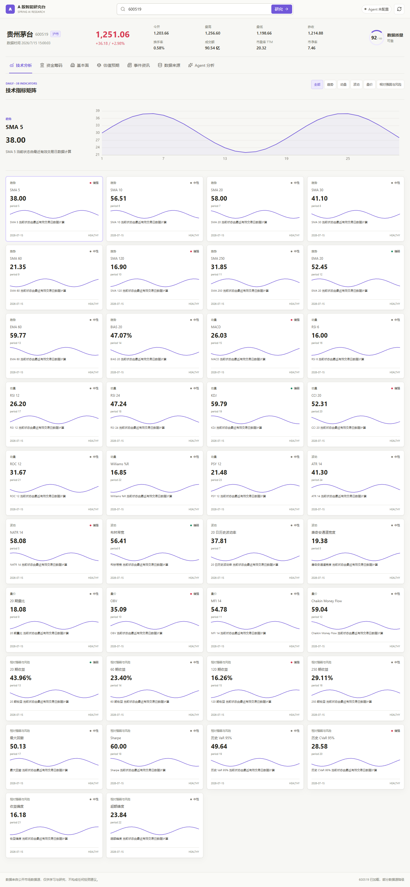
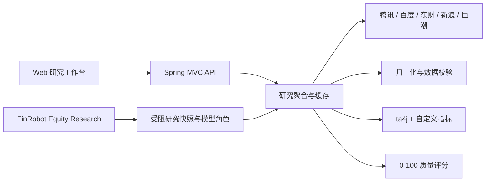

# A 股智能研究台 · FinRobot 投研

> FinRobot 默认入口现已接入固定版本的官方 Equity 八个专题 Agent，通过 Python Worker 执行。
> 安装、异步任务接口、复用范围和估值限制见 [官方 FinRobot 接入说明](docs/finrobot-official.md)。
> 下文旧同步 `/api/finrobot/research` 流程暂时保留用于迁移对照，不代表新的默认实现。

新增独立的“周期研究”标签：Agent 直接加载霍华德·马克斯原始 skill，检索原书并综合研究证据。配置、接口与边界见 [周期研究模块](docs/cycle-research.md)。

一个用于学习 Agent 工程实践的 Spring AI 股票研究项目。它从多个公开数据源获取真实 A 股行情与研究数据，先完成归一化、校验和技术指标计算，再把有来源证据的数据交给 FinRobot Equity Research 流水线。未配置模型时，行情、技术分析和确定性投研报告仍可独立运行。



## 功能范围

- 股票代码或名称搜索，首版覆盖沪深北 A 股代码规则。
- 腾讯实时行情与前复权日 K 线，百度 K 线独立交叉核验。
- 38 张技术指标卡：均线、MACD、RSI、KDJ、CCI、波动率、量价、收益、回撤、VaR、CVaR、偏度、峰度等。
- 资金筹码、财务报表、估值预期、研报、新闻与公告分区展示。
- 每个数据区块保留状态、来源、源时间、抓取时间、缓存和降级信息。
- 0-100 数据质量评分，按新鲜度、一致性、完整度和权威性拆分。
- FinRobot 单证券投研：证据快照、研究分析、估值建模、风险复核和报告综合统一为一个入口。
- UZI 投研：独立运行官方 UZI-Skill 的 22 维度研究，并保留公司画像、竞争对手、盈利预测、结构化估值、原始维度、来源和数据缺口。
- 可选 Spring AI 模型，仅能接收项目声明的有界研究快照，不能访问任意 URL。
- 浅灰白与浅紫研究工作台，A 股红涨绿跌，桌面四列指标矩阵与移动端单列布局。

## 一键启动

仓库不使用 Docker Compose。项目脚本会把 Temurin JDK `21.0.11+10`、Maven `3.9.11` 和依赖缓存放在仓库的忽略目录中，不依赖系统安装的 JDK 或 Maven。

Windows：

```bat
start.cmd
```

Linux / macOS：

```bash
chmod +x start.sh mvnw scripts/*.sh
./start.sh
```

首次运行需要网络下载固定版本工具链和 Maven 依赖，脚本会校验 JDK SHA-256。启动后访问 [http://localhost:10001](http://localhost:10001)。

## 本地模型配置

模型配置不是运行行情研究功能的前置条件。需要 Agent 综合报告时，先基于示例创建本地文件。如果文件已经存在，不要重复覆盖：

```powershell
Copy-Item config/application-local.yml.example config/application-local.yml
```

```bash
cp config/application-local.yml.example config/application-local.yml
```

编辑 `config/application-local.yml` 中的 `app.ai.models`，多个 OpenAI 兼容模型可以同时启用，不需要再通过注释整段 `spring:` 配置来切换。`app.ai.roles` 将业务角色映射到命名模型：`finrobot-research` 默认使用 `deepseek`，财报专项仍使用 `financial-report` 角色。顶部有一个全局模型选择器，FinRobot（官方/旧引擎）、周期研究、UZI 投研和财报分析共用同一个选择，选择结果保存在浏览器本地；应用启动时会对每个已配置模型做一次连通性探测（每模型限时 15 秒），选择器中用绿/红/灰点显示可用、不可用与未探测。修改模型、角色或密钥后请重启应用。

```yaml
spring:
  ai:
    # 关闭 Spring AI 的单模型自动配置，由 app.ai.models 管理多个命名模型。
    model:
      chat: none
      embedding: none
      image: none
      moderation: none
      audio:
        speech: none
        transcription: none

app:
  ai:
    models:
      primary:
        enabled: true
        base-url: "https://api.openai.com"
        api-key: "replace-with-openai-api-key"
        completions-path: "/v1/chat/completions"
        model: "replace-with-openai-model"
        temperature: 0.2
      deepseek:
        enabled: true
        base-url: "https://api.deepseek.com"
        api-key: "replace-with-deepseek-api-key"
        completions-path: "/v1/chat/completions"
        model: "deepseek-chat"
        temperature: 0.1
      mimo:
        enabled: false
        base-url: "https://api.xiaomimimo.com/v1"
        api-key: "replace-with-mimo-api-key"
        completions-path: "/chat/completions"
        model: "mimo-v2.5-pro"
        temperature: 0.2
    roles:
      finrobot-research: deepseek
      institutional-report: primary
```

三家供应商都通过项目现有的 Spring AI OpenAI Chat Completions 客户端连接，不需要增加额外 SDK。页面顶部的全局模型选择器消费 `GET /api/ai/models` 的安全目录，选择后由服务端按命名模型 ID 路由请求；各生成入口不再各自维护下拉框。浏览器只接收模型 ID、实际模型名、角色归属和连通性状态，不会接收 API Key、Base URL 或连接参数。模型仅负责受校验约束的投研叙述，确定性指标、估值表、资金流、来源和缺失数据由 Java 数据链路生成。

| 供应商 | Base URL | 默认示例模型 | 额外配置 |
| --- | --- | --- | --- |
| OpenAI | `https://api.openai.com` | 按账号填写 | 无 |
| DeepSeek | `https://api.deepseek.com` | `deepseek-chat` | 无 |
| Xiaomi MiMo | `https://api.xiaomimimo.com/v1` | `mimo-v2.5-pro` | `chat.completions-path: /chat/completions` |

`config/application-local.yml` 已被 Git 忽略，可以在其中填写本机密钥。不要把真实密钥复制到 `application-local.yml.example`、README、日志、测试或提交历史中。模型只接收应用内部生成的完整规范化快照，不具备任意 URL、文件系统或命令执行能力；报告输出会经过本地结构校验，并固定保留“仅供学习研究，不构成投资建议”。修改供应商、密钥或模型后必须重启应用。

如果启动时报 `OpenAI API key must be set` 且 Bean 名称为 `openAiAudioSpeechModel`，这是 Spring AI 默认启用了语音模型，不是聊天模型配置失效。确认本地文件包含 `spring.ai.model.audio.speech: none` 和 `spring.ai.model.audio.transcription: none`，并从项目根目录启动。IDEA 的 Run Configuration 工作目录应为项目根目录 `D:\Code\Java_Code\a-stock-agent`，否则 `./config/application-local.yml` 不会被导入。

IDEA 的 Project SDK、模块 SDK、Maven Runner 和 Maven Importer 都应选择 JDK 21。项目 `pom.xml` 声明了 Java 21；如果日志出现 `javac 17`、`不支持发行版本 21` 或 Maven 使用 JDK 8/11，请先切换 JDK，再重新导入 Maven 项目并执行 Rebuild。

## UZI Python 环境

UZI 页面通过项目内固定的 `scripts/uzi-worker.py` 调用官方 `wbh604/UZI-Skill` 的 `run.py`。官方仓库和虚拟环境放在 Git 忽略目录中，不复制进本项目，也不把 Python 命令、路径或密钥暴露给页面。Windows 首次准备环境：

```powershell
.\scripts\setup-uzi.ps1
```

也可以使用：

```bat
scripts\setup-uzi.cmd
```

脚本会准备 `tools/uzi/UZI-Skill` 和 `tools/uzi/.venv`，并打印应写入 `config/application-local.yml` 的 `app.uzi.python` 路径。UZI 的模型密钥只放在被忽略的本地配置或系统环境变量中；未安装、Python 不可用、依赖不完整、模型失败和数据缺口都会在 UZI 页面中单独显示，不会生成伪造的研究结论。

## 架构



详细数据流见 [docs/architecture/data-flow.md](docs/architecture/data-flow.md)，数据源能力和降级关系见 [docs/data-sources/provider-matrix.md](docs/data-sources/provider-matrix.md)。

## Agent 学习路径

1. 从 `SecurityId`、`DataSection`、`Provenance` 理解 Agent 为什么需要稳定、可追踪的工具返回值。
2. 阅读 `ProviderHttpClient`、`ProviderThrottle`、`ProviderHealthRegistry`，理解超时、重试、冷却与防封。
3. 阅读 `ResearchAggregationService`，观察并行获取与区块级部分成功如何组合。
4. 阅读 `TechnicalAnalysisService` 和 `DataQualityScorer`，理解确定性计算应在模型调用前完成。
5. 阅读 `StockAgentTools`、`FinRobotResearchService` 和 `FinRobotReportMapper`，理解工具边界、角色编排、结构化输出和缺失数据披露。
6. 在 `config/application-local.yml` 配置兼容模型，通过页面或 `/api/finrobot/research` 比较 FinRobot 叙述与原始证据。

## 数据可靠性

核心行情遵循 `a-stock-data` 的优先级：腾讯用于实时行情和 K 线，百度用于独立 K 线核验；东财只承担板块、资金、研报、新闻和筹码事件等独有数据，并通过全局串行限流器将请求间隔控制在至少 1 秒并加入抖动。新浪提供财务报表和资金流备份，巨潮用于官方公告。

公开、脱敏的 `600519` 响应样本保存在 `src/test/resources/fixtures`。2026-07-15 验证样本中，贵州茅台最新价与收盘价为 `1251.06`，腾讯与百度的最近交易日收盘价一致。实时结果会随交易日变化，应以验证报告中的源时间为准。

## API

书本方法笔记作为蜡烛图分析和总体报告的内部方法上下文使用，不提供独立查询入口。
当前包含 17 条经过章节核对的尼森方法概括，其中 14 条已接入当前分析、3 条仅作为后续扩展参考，并非全书全文。笔记仅作为分析内部方法上下文随 JAR 打包，不提供书本查询入口，也不依赖开发者电脑的 skill、EPUB 路径或向量数据库。
技术分析的“方法、章节与限制”只展示随当前分析返回的关联方法摘要；总体报告会加载方法上下文辅助解释，当前事实仍严格以行情快照为准。
新增孕线/十字孕线与历史失效追踪规则，阈值、确认条件和局限可在接口中审计。
部署和持续扩充步骤见 [书本方法知识库](docs/architecture/book-knowledge.md)。

| 方法 | 路径 | 用途 |
|---|---|---|
| GET | `/api/stocks/search?q=600519` | 搜索股票 |
| GET | `/api/stocks/{code}/snapshot` | 完整研究快照 |
| GET | `/api/stocks/{code}/technical?timeframe=DAILY` | 技术指标 |
| GET | `/api/stocks/{code}/sources` | 来源与质量状态 |
| GET | `/api/finrobot/status` | FinRobot 模型配置状态 |
| GET | `/api/ai/models` | 统一模型目录：安全字段、角色归属与启动探测的连通性 |
| GET | `/api/finrobot/models` | 获取 FinRobot 安全模型目录（兼容保留） |
| POST | `/api/finrobot/research` | 生成完整 FinRobot 单证券投研报告；`modelId` 可选 |
| POST | `/api/agent/financial-report` | 财报分析（F-Score 财务质量评分 + 多期趋势 + DeepSeek 叙事，失败时确定性回退） |
| GET | `/api/system/providers` | 数据源健康状态 |
| GET | `/actuator/health` | 应用健康检查 |

### Agent 学习闭环

项目提供一个默认关闭、无需 API Key 的离线学习入口，用于观察 Chat Memory、Advisor、Embedding、Vector Store、RAG 和受限 MCP 工具的完整链路。

开启方式：在 `application-local.yml` 中增加 `app.agent.learning.enabled: true`，然后调用：

```http
POST /api/agent/learning/chat
Content-Type: application/json
```

```json
{
  "code": "600519",
  "message": "解释盈利和技术风险",
  "conversationId": "demo-600519"
}
```

没有模型配置时，响应中的 `modelUsed` 为 `offline-deterministic`，仍会返回会话消息数量、Advisor trace、检索文档、来源元数据和工具执行结果。配置 OpenAI 兼容模型后，Facade 会使用同一 Advisor 链调用 `ChatClient`。

Embedding 和 Vector Store 当前是进程内确定性实现，仅用于学习和离线测试，不代表生产级语义检索方案。MCP WebMVC Server 默认关闭；需要协议传输时，在本地配置中显式设置 `spring.ai.mcp.server.enabled: true`，并继续使用项目的受限工具边界。

错误响应使用 RFC 9457 Problem Details。

## 测试与验证

离线单元和契约测试不会访问公开数据源：

```powershell
.\mvnw.cmd '-Dmaven.repo.local=.m2/repository' test
```

真实数据验证会串行调用公开来源，验证 `600519`、`000001`、`300750` 并在 `target/data-verification` 生成带时间戳的 JSON 与 Markdown 报告：

```bat
scripts\verify-data.cmd
```

```bash
./scripts/verify-data.sh
```

前端回归测试需要 Node.js 20+ 和本机 Chrome：

```powershell
npm.cmd install --cache .npm-cache
npm.cmd run test:ui
```

测试覆盖 `1440x1000`、`1024x768`、`768x1024`、`390x844`，检查四/三/二/一列布局、ECharts canvas 像素、固定顶栏遮挡、按钮内容和横向溢出。

## 常见问题

`403`、`429` 或东财数据暂不可用：应用不会高频重试，而是让该来源进入冷却并保留其他区块。等待冷却结束后刷新，不要并发批量请求或绕过 `ProviderThrottle`。

Agent 显示“未配置”：这是默认状态。行情与指标仍正常工作；需要报告时检查 `config/application-local.yml` 中对应角色的 `enabled`、`api-key`、`base-url`、`completions-path` 和模型名，并确认角色映射仍指向已启用的命名模型。

首次启动下载失败：确认可访问 GitHub Releases 和 Maven Central，删除未完成的 `.tools/downloads` 对应压缩包后重试。不要跳过脚本内的 SHA-256 校验。

系统 JDK/Maven 版本不匹配：使用 `start.ps1` / `start.sh` 或项目 Wrapper，不要直接依赖全局 `java`、`mvn`。

## 同行业估值与资金流明细

数据快照中的同行估值对比由确定性规则计算：先选取目标股票总市值最接近的 5 家同行，再选取行业总市值最大的 3 家龙头。两组结果按稳定顺序合并；同一家公司同时命中两组时会合并显示“市值接近”和“行业龙头”标签，不重复展示。

资金流明细展示最新交易日以及近 5 日、近 20 日窗口的主力、超大单、大单、中单和小单净流入。每个窗口同时返回 `sampleDays / requestedDays`；交易日不足时展示实际样本数，不用零值补齐，也不把缺失类别伪造成可用数据。

该功能复用现有数据链路，不新增外部数据源：同行估值使用东财行业数据，资金流优先使用东财并沿用新浪备份链路。当前不包含北向资金、行业整体资金流或席位级资金明细；这些数据需要独立的数据源和口径，暂不在报告中声明为已提供。

## 项目工具链

项目级 JDK 21 固定在 `.tools/jdk-21`（Windows 路径为 `D:\Code\Java_Code\a-stock-agent\.tools\jdk-21`）。运行 Maven 前请先设置 `JAVA_HOME` 和 `Path`，避免误选系统 Java 8/11；`start.ps1` 会自动完成同样的设置。

## 投资风险声明

本项目仅用于软件工程、Spring AI 和 Agent 学习。公开数据可能延迟、缺失或因供应商接口调整而变化，技术指标基于历史数据，不能预测未来。本项目不提供买卖指令，不构成任何投资建议或收益承诺。
## FinRobot equity research flow

`POST /api/finrobot/research` first aggregates a single timestamped snapshot,
then runs the fixed-weight `ResearchJudgementEngine` and the bounded FinRobot
research roles. Its direction is one of `STRONGER`, `NEUTRAL`, `WEAKER` and
`INSUFFICIENT`; the internal weighted score is never returned and
`EvidenceStatus` is a data-availability state, not a confidence probability.
Industry PE/PB percentiles and consensus EPS are optional,
provenance-preserving evidence.

`FinRobotResearchService` sends only a bounded evidence package to the optional
chat model. When a completed UZI bundle exists, its normalized four-category
evidence, raw dimensions, gaps and source references are added to that package.
Fixed calculations and data validation stay outside the model;
invalid model output or a timeout returns a deterministic FinRobot-compatible
report. The unified report always retains conflicts, missing data, sources and
`仅供学习研究，不构成投资建议`.
