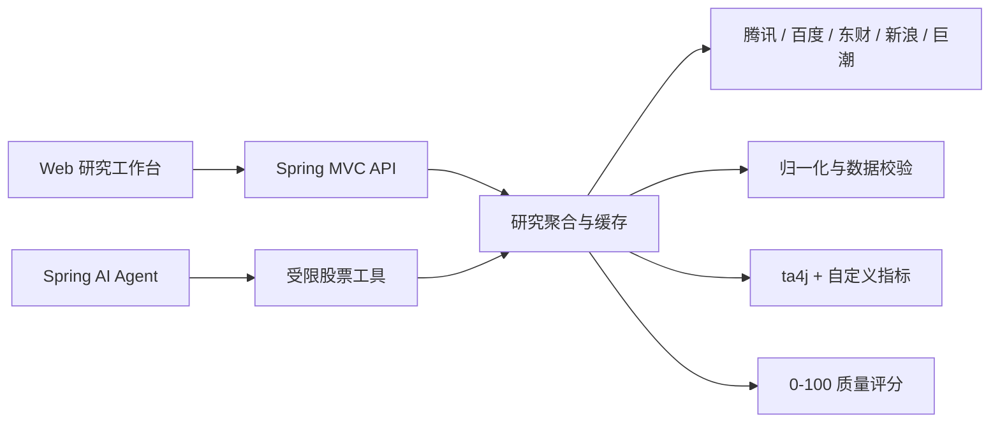

# A 股智能研究 Agent

一个用于学习 Agent 工程实践的 Spring AI 股票研究项目。它从多个公开数据源获取真实 A 股行情与研究数据，先完成归一化、校验和技术指标计算，再把有来源证据的数据交给可选的 Spring AI Agent。未配置模型时，行情、技术分析和全部 REST API 仍可独立运行。


## 功能范围

- 股票代码或名称搜索，首版覆盖沪深北 A 股代码规则。
- 腾讯实时行情与前复权日 K 线，百度 K 线独立交叉核验。
- 38 张技术指标卡：均线、MACD、RSI、KDJ、CCI、波动率、量价、收益、回撤、VaR、CVaR、偏度、峰度等。
- 资金筹码、财务报表、估值预期、研报、新闻与公告分区展示。
- 每个数据区块保留状态、来源、源时间、抓取时间、缓存和降级信息。
- 0-100 数据质量评分，按新鲜度、一致性、完整度和权威性拆分。
- 可选 Spring AI Agent，仅能调用项目声明的受限股票工具，不能访问任意 URL。
- 浅灰白与浅紫研究工作台，A 股红涨绿跌，桌面四列指标矩阵与移动端单列布局。

## 一键启动

仓库不使用 Docker Compose。项目脚本会把 Temurin JDK `21.0.11+10`、Maven `3.9.11` 和依赖缓存放在仓库的忽略目录中，不依赖系统安装的 JDK 或 Maven。

Windows：

```bat
start.cmd
```

Linux / macOS：

```bash
chmod +x start.sh mvnw scripts/*.sh
./start.sh
```

首次运行需要网络下载固定版本工具链和 Maven 依赖，脚本会校验 JDK SHA-256。启动后访问 [http://localhost:8080](http://localhost:8080)。

## 本地模型配置

模型配置不是运行行情研究功能的前置条件。需要 Agent 综合报告时，先基于示例创建本地文件。如果文件已经存在，不要重复覆盖：

```powershell
Copy-Item config/application-local.yml.example config/application-local.yml
```

```bash
cp config/application-local.yml.example config/application-local.yml
```

编辑 `config/application-local.yml`，任何时刻只保留一个完整的 `spring:` 配置块处于未注释状态。切换模型供应商时，先注释当前配置，再取消目标模板的整段注释，填写对应的 `api-key` 和账号实际可用的模型名称，最后重新运行 `.\start.ps1`。

```yaml
# 当前启用：OpenAI。填写 API Key 和账号可用的模型名称后重启应用。
spring:
  ai:
    model:
      chat: openai
    openai:
      api-key: "replace-with-openai-api-key"
      base-url: "https://api.openai.com"
      chat:
        options:
          model: "replace-with-openai-model"
          temperature: 0.2

# DeepSeek 模板：切换时注释上面的 OpenAI 配置，再取消下面整段注释。
# spring:
#   ai:
#     model:
#       chat: openai
#     openai:
#       api-key: "replace-with-deepseek-api-key"
#       base-url: "https://api.deepseek.com"
#       chat:
#         options:
#           model: "deepseek-chat"
#           temperature: 0.2

# Xiaomi MiMo 模板：Spring AI 默认追加 /v1/chat/completions，
# 因此官方 /v1 Base URL 需要把 completions-path 改为 /chat/completions。
# spring:
#   ai:
#     model:
#       chat: openai
#     openai:
#       api-key: "replace-with-mimo-api-key"
#       base-url: "https://api.xiaomimimo.com/v1"
#       chat:
#         completions-path: "/chat/completions"
#         options:
#           model: "mimo-v2.5-pro"
#           temperature: 0.2
```

三家供应商都通过项目现有的 Spring AI OpenAI Chat Completions 客户端连接，不需要增加额外 SDK：

| 供应商 | Base URL | 默认示例模型 | 额外配置 |
| --- | --- | --- | --- |
| OpenAI | `https://api.openai.com` | 按账号填写 | 无 |
| DeepSeek | `https://api.deepseek.com` | `deepseek-chat` | 无 |
| Xiaomi MiMo | `https://api.xiaomimimo.com/v1` | `mimo-v2.5-pro` | `chat.completions-path: /chat/completions` |

`config/application-local.yml` 已被 Git 忽略，可以在其中填写本机密钥。不要把真实密钥复制到 `application-local.yml.example`、README、日志、测试或提交历史中。修改供应商、密钥或模型后必须重启应用。

## 架构



详细数据流见 [docs/architecture/data-flow.md](docs/architecture/data-flow.md)，数据源能力和降级关系见 [docs/data-sources/provider-matrix.md](docs/data-sources/provider-matrix.md)。

## Agent 学习路径

1. 从 `SecurityId`、`DataSection`、`Provenance` 理解 Agent 为什么需要稳定、可追踪的工具返回值。
2. 阅读 `ProviderHttpClient`、`ProviderThrottle`、`ProviderHealthRegistry`，理解超时、重试、冷却与防封。
3. 阅读 `ResearchAggregationService`，观察并行获取与区块级部分成功如何组合。
4. 阅读 `TechnicalAnalysisService` 和 `DataQualityScorer`，理解确定性计算应在模型调用前完成。
5. 阅读 `StockAgentTools` 和 `StockAnalysisAgent`，理解工具边界、结构化输出和缺失数据披露。
6. 在 `config/application-local.yml` 配置兼容模型，通过页面或 `/api/agent/analyze` 比较模型综合与原始证据。

## 数据可靠性

核心行情遵循 `a-stock-data` 的优先级：腾讯用于实时行情和 K 线，百度用于独立 K 线核验；东财只承担板块、资金、研报、新闻和筹码事件等独有数据，并通过全局串行限流器将请求间隔控制在至少 1 秒并加入抖动。新浪提供财务报表和资金流备份，巨潮用于官方公告。

公开、脱敏的 `600519` 响应样本保存在 `src/test/resources/fixtures`。2026-07-15 验证样本中，贵州茅台最新价与收盘价为 `1251.06`，腾讯与百度的最近交易日收盘价一致。实时结果会随交易日变化，应以验证报告中的源时间为准。

## API

| 方法 | 路径 | 用途 |
|---|---|---|
| GET | `/api/stocks/search?q=600519` | 搜索股票 |
| GET | `/api/stocks/{code}/snapshot` | 完整研究快照 |
| GET | `/api/stocks/{code}/technical?timeframe=DAILY` | 技术指标 |
| GET | `/api/stocks/{code}/sources` | 来源与质量状态 |
| GET | `/api/agent/status` | Agent 配置状态 |
| POST | `/api/agent/analyze` | 生成结构化研究报告 |
| GET | `/api/system/providers` | 数据源健康状态 |
| GET | `/actuator/health` | 应用健康检查 |

错误响应使用 RFC 9457 Problem Details。

## 测试与验证

离线单元和契约测试不会访问公开数据源：

```powershell
.\mvnw.cmd '-Dmaven.repo.local=.m2/repository' test
```

真实数据验证会串行调用公开来源，验证 `600519`、`000001`、`300750` 并在 `target/data-verification` 生成带时间戳的 JSON 与 Markdown 报告：

```bat
scripts\verify-data.cmd
```

```bash
./scripts/verify-data.sh
```

前端回归测试需要 Node.js 20+ 和本机 Chrome：

```powershell
npm.cmd install --cache .npm-cache
npm.cmd run test:ui
```

测试覆盖 `1440x1000`、`1024x768`、`768x1024`、`390x844`，检查四/三/二/一列布局、ECharts canvas 像素、固定顶栏遮挡、按钮内容和横向溢出。

## 常见问题

`403`、`429` 或东财数据暂不可用：应用不会高频重试，而是让该来源进入冷却并保留其他区块。等待冷却结束后刷新，不要并发批量请求或绕过 `ProviderThrottle`。

Agent 显示“未配置”：这是默认状态。行情与指标仍正常工作；需要报告时检查本地 YAML 中的 `spring.ai.model.chat`、`api-key`、`base-url` 和模型名。

首次启动下载失败：确认可访问 GitHub Releases 和 Maven Central，删除未完成的 `.tools/downloads` 对应压缩包后重试。不要跳过脚本内的 SHA-256 校验。

系统 JDK/Maven 版本不匹配：使用 `start.ps1` / `start.sh` 或项目 Wrapper，不要直接依赖全局 `java`、`mvn`。

## 投资风险声明

本项目仅用于软件工程、Spring AI 和 Agent 学习。公开数据可能延迟、缺失或因供应商接口调整而变化，技术指标基于历史数据，不能预测未来。本项目不提供买卖指令，不构成任何投资建议或收益承诺。
