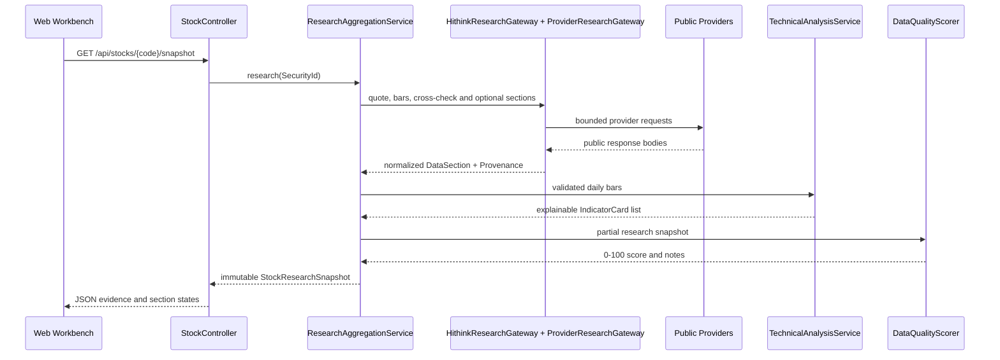

# Data Flow

> 学习入口：如果你第一次阅读本项目，先看
> [`agent-learning-guide.md`](agent-learning-guide.md)，再回到本文查看数据层边界。

## Request Path



## Ownership Boundaries

下面的边界是这个项目最重要的 Agent 学习目标：模型只能消费已经规范化、带来源的证据，不能越过数据和安全边界直接访问供应商。

`marketdata/provider` owns transport, decoding, provider-specific fields, throttling and cooldown. Provider models do not leak into controllers.

`marketdata/model` owns provider-independent values and provenance. Monetary amounts are normalized to yuan and volumes to shares where available.

`marketdata/validation` owns identity, OHLC, timestamp, ordering, duplication and history-length checks.

`analysis` owns partial-success orchestration, fallbacks, caching and quality scoring. A failure in research, news or announcements cannot erase a healthy quote.

`technical` owns deterministic computations. ta4j is used for established indicators; custom formulas are limited to metrics not available in the Java 21-compatible ta4j line.

`agent` owns bounded Spring AI tools and structured synthesis. The model never receives an arbitrary HTTP or URL-fetch tool.

`web` and `static` own API contracts and presentation. The UI displays section status and provenance without inventing missing values.

## Offline Agent Learning Loop

The optional `/api/agent/learning/chat` endpoint demonstrates the complete local pipeline without model credentials:

```text
request -> Chat Memory -> Trace/RAG Advisors -> deterministic Embedding
         -> in-memory Vector Store -> bounded MCP tool provider
         -> evidence-only response
```

## Report Paths

默认页面使用 `POST /api/finrobot/tasks`：`OfficialFinRobotService` 管理异步任务，
`OfficialFinRobotWorker` 整理规范化快照和财报证据，再由 `scripts/finrobot_worker.py`
执行固定版本的八个官方专题 Agent。任务通过 `/api/finrobot/tasks/{id}` 轮询；章节失败
可形成部分报告，全部失败不返回成功报告。模型章节为 UNVERIFIED，不自动回退旧报告。

兼容的 `POST /api/finrobot/research` 由 `FinRobotResearchService` 调用总体报告生成器和
校验器；无模型或生成失败时才使用 `ResearchJudgementEngine` 和
`InstitutionalReportComposer` 生成确定性回退。内部加权分不序列化；缺失、冲突、
来源和免责声明均保留。旧 `/api/agent/analyze` 已不在当前 REST Controller 中。

财报使用 `/api/agent/financial-report`，周期研究使用 `/api/agent/cycle/tasks`，
UZI 使用 `/api/uzi/tasks`。前端统一从 `/api/ai/models` 取得安全模型目录并传递 modelId。
周期模块仅允许在配置书库内检索和阅读，不提供任意文件或 URL 工具。

学习入口的 ChatClient（可选）继续使用 Trace/RAG Advisor 链；向量索引仅保存在内存中，
元数据保留代码、分区、供应商、来源 URL 和时间。MCP 协议服务默认关闭。

## Partial Success

Each `DataSection<T>` is `HEALTHY`, `DEGRADED`, `STALE`, `UNVERIFIED`, or `UNAVAILABLE`. A usable payload always carries provenance. `UNAVAILABLE` carries issues but no payload. The aggregate request fails only when both quote and primary K-line sources are unavailable.

## Cache And Freshness

Caffeine stores completed snapshots by `SecurityId`. `ResearchAggregationService.invalidate` can invalidate the entry internally; the current stock REST controller does not expose a force-refresh parameter. Provenance differentiates source time from fetch time and records whether a result was cached or supplied by a fallback.
