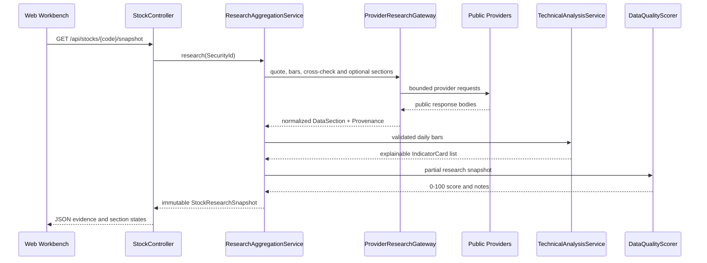

# Data Flow

## Request Path



## Ownership Boundaries

`marketdata/provider` owns transport, decoding, provider-specific fields, throttling and cooldown. Provider models do not leak into controllers.

`marketdata/model` owns provider-independent values and provenance. Monetary amounts are normalized to yuan and volumes to shares where available.

`marketdata/validation` owns identity, OHLC, timestamp, ordering, duplication and history-length checks.

`analysis` owns partial-success orchestration, fallbacks, caching and quality scoring. A failure in research, news or announcements cannot erase a healthy quote.

`technical` owns deterministic computations. ta4j is used for established indicators; custom formulas are limited to metrics not available in the Java 21-compatible ta4j line.

`agent` owns bounded Spring AI tools and structured synthesis. The model never receives an arbitrary HTTP or URL-fetch tool.

`web` and `static` own API contracts and presentation. The UI displays section status and provenance without inventing missing values.

## Offline Agent Learning Loop

The optional `/api/agent/learning/chat` endpoint demonstrates the complete local pipeline without model credentials:

```text
request -> Chat Memory -> Trace/RAG Advisors -> deterministic Embedding
         -> in-memory Vector Store -> bounded MCP tool provider
         -> evidence-only response
```

When an OpenAI-compatible chat model is configured, the same advisors are passed to `ChatClient`; otherwise the deterministic evidence response is returned. The local vector index stores only normalized research evidence and preserves security code, section, provider, source URL, provider time and fetch time. MCP server transport is disabled by default and must be explicitly enabled in local configuration.

## Partial Success

Each `DataSection<T>` is `HEALTHY`, `DEGRADED`, `STALE`, `UNVERIFIED`, or `UNAVAILABLE`. A usable payload always carries provenance. `UNAVAILABLE` carries issues but no payload. The aggregate request fails only when both quote and primary K-line sources are unavailable.

## Cache And Freshness

Caffeine stores completed snapshots by `SecurityId`. Explicit refresh invalidates the entry. Provenance differentiates source time from fetch time and records whether a result was cached or supplied by a fallback.
